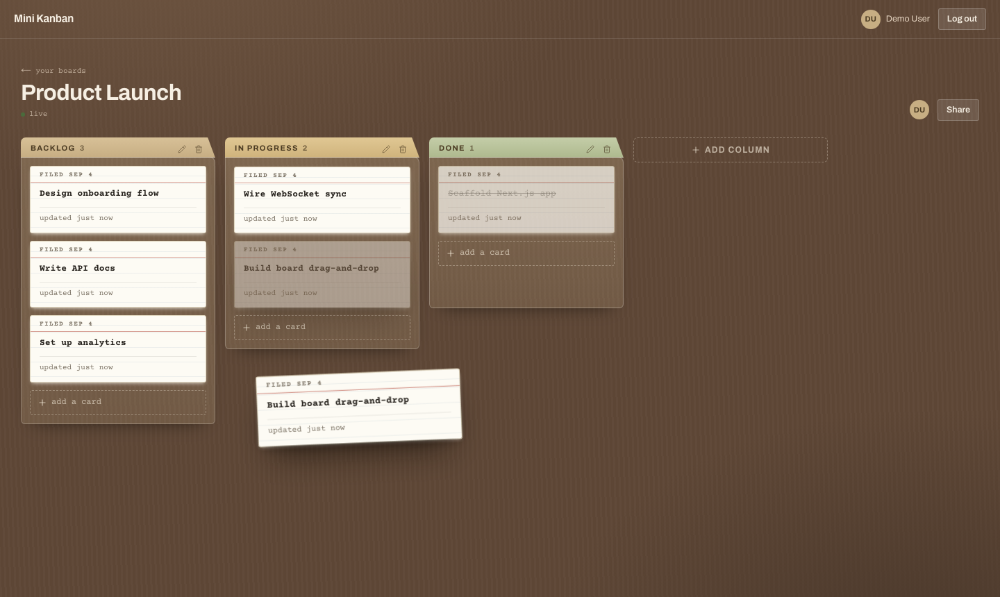

# Mini Kanban Board

A full-stack Kanban board — boards → columns → tasks — with token-based auth, per-board
role-based sharing (Owner/Editor/Viewer), and a drag-and-drop board view backed by a
conflict-free, position-index-aware task-movement API. Built as a 4-day take-home technical
assessment for **Webbriks**. Full design rationale — schema, the task-movement API, authorization,
security, and the frontend drag-and-drop architecture — lives in [PLAN_EN.md](PLAN_EN.md).



## Applications

| Directory | Description |
|------|--------------|
| [mini-kanban-frontend/](mini-kanban-frontend/) | Next.js 14 (App Router) + React 18 + TypeScript + Tailwind, `dnd-kit` drag-and-drop |
| [mini-kanban-backend/](mini-kanban-backend/) | NestJS 10 + TypeScript + Prisma 6, PostgreSQL 16, Socket.IO realtime gateway |

Both live in this repository as ordinary directories — a plain `git clone` gets you everything,
no submodules involved.

## Quick start (Docker)

```bash
git clone https://github.com/AlEkramHossainAbir/mini-kanban.git
cd mini-kanban
cp .env.example .env
docker compose up --build
```

That's it — no other manual steps. Once the containers are up:

- Frontend: [http://localhost:3000](http://localhost:3000)
- Backend health check: `curl http://localhost:4000/api/v1/health` → `{"status":"ok"}`

The backend container waits for Postgres's healthcheck before starting, then runs
`prisma migrate deploy` automatically as part of its own `CMD` — the database schema is created
for you, no manual migration step required.

Migrations create the schema but not any data — to log in with the demo credentials below against
this local database, seed it once:

```bash
docker compose exec backend npm run db:seed
```

Safe to re-run; it upserts the demo user and only seeds its board the first time.

## Local development without Docker

Each app runs with its own `npm install` + dev server, against a standalone Postgres container:

```bash
# 1. Database
docker run --name kanban-db \
  -e POSTGRES_USER=kanban -e POSTGRES_PASSWORD=kanban -e POSTGRES_DB=kanban \
  -p 5432:5432 -d postgres:16-alpine

# 2. Backend — http://localhost:4000/api/v1
cd mini-kanban-backend
cp .env.example .env   # DATABASE_URL already points at the container above
npm install
npx prisma migrate deploy
npm run db:seed        # creates the demo login below (safe to re-run)
npm run start:dev

# 3. Frontend — http://localhost:3000
cd mini-kanban-frontend
# No `cp .env.example .env` here (unlike the backend): both variables it defines
# already default to http://localhost:4000 in code — see next.config.mjs and
# src/lib/realtime.ts — which matches the backend above. Copy it only if your
# backend runs elsewhere or you'd rather have the values written down.
npm install
npm run dev
```

The frontend proxies `/api/v1/*` to `BACKEND_URL` via a Next.js rewrite (`next.config.mjs`) so the
browser only ever talks to one origin — this is what lets `SameSite=Lax` auth cookies survive
(see [PLAN_EN.md §1](PLAN_EN.md#1-system-architecture-overview)). `next.config.mjs` reads
`BACKEND_URL` once, when it's loaded — for `npm run dev` that's when the dev server starts, for
`npm run build` it's baked into the production output and can't be changed at `next start` time
afterwards. That's why Docker passes it as a build `ARG` rather than through `env_file:` — see
[docker-compose.yml](docker-compose.yml)'s comments and
[mini-kanban-frontend/ROADMAP.md](mini-kanban-frontend/ROADMAP.md) Phase 2/12 for why. If your
backend runs somewhere other than `localhost:4000`, point the dev server at it explicitly, e.g.
`BACKEND_URL=http://localhost:5000 npm run dev`.

## Sample environment variables

Committed as [.env.example](.env.example) at the repo root — copy it to `.env` before
`docker compose up`. Both the `mini-kanban-backend/` and `mini-kanban-frontend/` directories also
carry their own `.env.example` for running each app outside Docker.

```bash
POSTGRES_USER=kanban
POSTGRES_PASSWORD=kanban
POSTGRES_DB=kanban

# `db` is the compose service name — resolved inside the Docker network.
DATABASE_URL=postgresql://kanban:kanban@db:5432/kanban?schema=public

JWT_ACCESS_SECRET=generate-with-openssl-rand-base64-32
JWT_REFRESH_SECRET=generate-a-different-one
ACCESS_TOKEN_TTL=15m
REFRESH_TOKEN_TTL=7d

FRONTEND_URL=http://localhost:3000
# Service name again: resolved server-side inside the Docker network.
BACKEND_URL=http://backend:4000
# localhost: resolved by the user's browser, not by a container.
NEXT_PUBLIC_WS_URL=http://localhost:4000

PORT=4000
NODE_ENV=development
```

Generate the two JWT secrets with `openssl rand -base64 32` each — they must be different values
(the app refuses to boot in production if they match, since that would make the refresh-token HMAC
key double as the access-token signing key).

## Tests

```bash
# Backend — 67 unit tests (pure: rank maths, guards, services against mocks)
cd mini-kanban-backend && npm test

# Backend — 57 e2e tests against a REAL Postgres, booting the real AppModule
# through the same configureApp() as main.ts: the full guard chain, the
# ValidationPipe, the rate limiter and the CSRF guard are all live.
# Point DATABASE_URL at the running database first (see Quick start).
npm run test:e2e

# Frontend — 36 unit tests (Vitest)
cd mini-kanban-frontend && npm test
```

The e2e suite is where the graded behaviour is pinned down: the `409` conflict
path and five concurrent movers with exactly one winner, the literal
`position`-index payload, cross-board IDOR returning the same `403` as a
non-existent board (no not-found oracle), `VIEWER` blocked on every mutation,
the last-owner guard, and a stale neighbour id self-healing into an append.

Frontend tests deliberately cover the *pure* logic rather than simulating drags
in jsdom — rank ordering, the optimistic-cache transforms, and the
drop→neighbour-id derivation that builds the move payload. Those are the pieces
where a silent regression corrupts board order; the drag interaction itself is
covered by the manual QA matrix in [PLAN_EN.md §10](PLAN_EN.md).

[`.github/workflows/ci.yml`](.github/workflows/ci.yml) runs all of the above on
every push, plus a job that does the `docker compose up --build` bring-up from a
clean checkout and asserts login works *through* the Next.js rewrite proxy.

## API endpoints

Every route below is under `/api/v1`. **Role** is the minimum `BoardMember` role required;
`EDITOR+` means `EDITOR` or `OWNER`. Full request/response shapes for the move endpoint are in
[PLAN_EN.md §3](PLAN_EN.md#3-api-surface--task-movement).

| Method | Route | Role | Notes |
|---|---|---|---|
| POST | `/auth/register` | public | |
| POST | `/auth/login` | public | sets `mk_at` + `mk_rt` cookies |
| POST | `/auth/refresh` | cookie | rotates the refresh token |
| POST | `/auth/logout` | auth | real server-side revocation |
| GET | `/auth/me` | auth | current user, for the app shell |
| GET | `/auth/ws-ticket` | auth | short-lived, single-use ticket for the Socket.IO handshake |
| GET | `/boards` | auth | cursor-paginated; boards the user is a member of |
| POST | `/boards` | auth | creator auto-inserted as `OWNER` member |
| GET | `/boards/:id` | member | board + columns + tasks; every task includes its `version` |
| PATCH | `/boards/:id` | EDITOR+ | rename / describe |
| DELETE | `/boards/:id` | OWNER | cascades columns → tasks |
| GET | `/boards/:id/members` | member | |
| POST | `/boards/:id/members` | OWNER | share with a registered user by email + role |
| PATCH | `/boards/:id/members/:userId` | OWNER | role change |
| DELETE | `/boards/:id/members/:userId` | OWNER | last-owner guard |
| POST | `/boards/:id/columns` | EDITOR+ | appended at end via the rank utility |
| PATCH | `/columns/:id` | EDITOR+ | rename |
| DELETE | `/columns/:id` | EDITOR+ | cascades its tasks |
| PATCH | `/columns/:id/move` | EDITOR+ | column reordering — same rank utility, same neighbor-id payload shape as task move |
| POST | `/columns/:id/tasks` | EDITOR+ | appended at end |
| PATCH | `/tasks/:id` | EDITOR+ | title / description |
| DELETE | `/tasks/:id` | EDITOR+ | |
| PATCH | `/tasks/:id/move` | EDITOR+ | the task-movement API, below |
| GET | `/health` | public | `{ status: 'ok' }` — Docker healthcheck / deploy probes |

## Architecture summary

**Ordering** uses fractional rank keys, not integer positions: each `Column`/`Task` carries a
`rank: String` drawn from a lexicographically ordered keyspace, and moving one row computes the
midpoint string between its new neighbours — no other row in the column is ever rewritten. A
background `rebalanceColumn()` re-spaces a column's ranks only when one grows past ~40 characters,
scoped to that column alone. See [PLAN_EN.md §2](PLAN_EN.md#2-database-schema-design-prisma)'s
"Ordering strategy" and [§3](PLAN_EN.md#3-api-surface--task-movement) for the full move-endpoint
contract, including the `beforeTaskId`/`afterTaskId` **and** literal `position`-index payload
shapes the brief asks for.

**Concurrency** on the move endpoint is optimistic, not lock-based: every `Task` carries a
`version`, every move must send `expectedVersion`, and the write is a single conditional
`UPDATE ... WHERE id = ? AND version = ?` inside a `SERIALIZABLE` transaction. A zero-row match —
someone else moved it first — returns `409 Conflict` with the task's fresh state, which the
frontend reconciles from directly rather than refetching the whole board. This keeps two users'
concurrent drags from silently clobbering each other while never holding a lock across a network
round trip. Full reasoning, including deadlock-avoidance and out-of-order response/event handling,
is in [PLAN_EN.md §3](PLAN_EN.md#3-api-surface--task-movement).

**Authorization** is role-based per board, not global: a `BoardMember` row (`OWNER` / `EDITOR` /
`VIEWER`) is the single source of truth for who can see or mutate a board, checked fresh on every
request by a `JwtAuthGuard → BoardAccessGuard → RolesGuard` chain shared by every board/column/task
route — there is no separate "or are you the owner" code path to forget, and no route that touches
board data skips the chain. Cross-board access is rejected structurally (an `EDITOR` on board A
can't target a `columnId` on board B), not just checked per-method. See
[PLAN_EN.md §4](PLAN_EN.md#4-authorization--access-control) for the full guard design and
[§5](PLAN_EN.md#5-security-hardening) for the rest of the security posture (CSRF header
enforcement, rate limiting, cookie hardening, audit logging).

## Live demo

- **App:** https://mini-kanban-frontend-seven.vercel.app
- **API:** https://backend-production-2621.up.railway.app/api/v1/health

Deployed per the sequence in [ROADMAP.md](ROADMAP.md) Phase 5: managed Postgres + backend on
Railway, frontend on Vercel, each step feeding the next one's URL. The
login-then-hard-refresh check that phase calls out (proof the same-origin proxy isn't dropping
cookies across the split deployment) has been verified against this exact deployment.

Demo credentials (seeded with one populated board, "Product Launch", 4 columns / 8 tasks, so the
board isn't empty on first login). The same credentials also work against a local
[Quick start](#quick-start-docker) instance — run `npm run db:seed` there (see above) to create
them locally:

```
email:    demo@example.com
password: DemoPass123!
```

## What's intentionally out of scope

Search & filtering, notifications, offline/local-first sync, and unbounded tasks-per-column
pagination are deliberately not built for this 4-day submission — each is a real Kanban-app
concern, scoped out on purpose rather than missed by oversight, with the reasoning for each
written out in [PLAN_EN.md §8](PLAN_EN.md#8-explicitly-out-of-scope-for-the-4-day-mvp). Scaling
this design to much larger traffic (read replicas, sharding by board, Redis caching, horizontal
API scaling) is a documented — not built — roadmap in [PLAN_EN.md](PLAN_EN.md), §7.

## Documentation

- [PLAN_EN.md](PLAN_EN.md) — the full system design: schema, the task-movement API and its
  rank-string ordering, authorization, security hardening, and the frontend drag-and-drop
  architecture
- [ROADMAP.md](ROADMAP.md) — the build order this project was actually implemented in, plus the
  per-app [backend](mini-kanban-backend/ROADMAP.md) and [frontend](mini-kanban-frontend/ROADMAP.md)
  roadmaps
- [mini-kanban-frontend/DESIGN.md](mini-kanban-frontend/DESIGN.md) — the "Filing Room" visual
  design system
- [Webbriks_Technical_Assessment.pdf](Webbriks_Technical_Assessment.pdf) — the original assessment
  brief this project was scoped against
